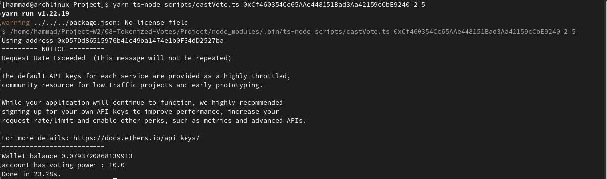

# Weekend project
* Form groups of 3 to 5 students
* Complete the contracts together
* Structure scripts to
  * Deploy everything
  * Interact with the ballot factory
  * Query proposals for each ballot
  * Operate scripts
* Publish the project in Github
* Run the scripts with a few set of proposals, play around with token balances, cast and delegate votes, create ballots from snapshots, interact with the ballots and inspect results
* Write a report detailing the addresses, transaction hashes, description of the operation script being executed and console output from script execution for each step
* (Extra) Use TDD methodology

# (Group#9 Members)
* Muhammad Hammad Mobin (@hammadmobin#3911)
* Ece Metin (@ece#1887)
* Udi İbgui (@udi#5722)
* Alfred Opon (@og1ste#6515)

|ChairPerson/Deployer| Token Address | Ballot | 
| :---: | :---: | :---: | 
|  0x6D4BA6307655015ece111A68cbC997de1aFd77B8 | 0xDAB502392ae31556a11757273bC109104442346C |0xCf460354Cc65AAe448151Bad3Aa42159cCbE9240 |

| Proposals |
| --- | 
| Apple |
| Banana | 
| Mango |

| Voters | Address | 
| --- | --- | 
| 1 | 0xD57Dd86515976b41c49ba1474e1b0F34dD2527ba|
| 2 | 0x3Db98A6E502C8c206e637801C948ea332473CB46 |
| 3 | 0x30122e077f55E61a5073b348Db3207Ec66da309B |
| 4 | 0xe3Bb54D8BE132243470e1488b804042AA3A5Ff1C |
| 5 | 0x63Fe9715D4627393D922872f31f8a6CaAE96EcD5 (Delegate) |

# Scripts

## Deploy Token
In this step, we deployed the token of our smart contract.

## Deploy Ballot Contract
Next we deploy the Ballot Contract address for voting.

## Mint Token
Here, we mint some token to the addresses.

## Cast a vote to a ballot 
In this step, we casting a vote to a proposals.

## Delegate my vote passing  user address as input 
Here, voter can delegate vote.

## Query voting result 
Here, we just make query that give us proposals vote count and name.

## Query Proposals
Its shows us the winning proposal, who got most vote.

## EtherScan Transaction Explorer 

